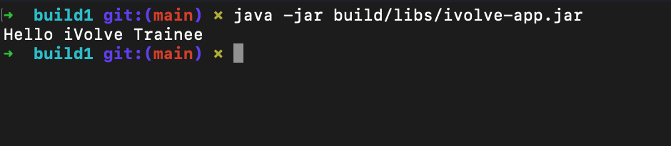

# 🚀 Lab 1: Building and Packaging Java Applications with Gradle

## 📌 Overview

This lab demonstrates how to build, test, and run a Java application using Gradle.

Source code:
https://github.com/Ibrahim-Adel15/build1.git

---

## 🧰 Tools Used

- Java (JDK 8 / 11+)
- Gradle
- Git
- macOS Terminal

---

## 📥 Setup Steps

### 1. Install Gradle

```bash
brew install gradle

## 📸 Build Result

```

```md

```
