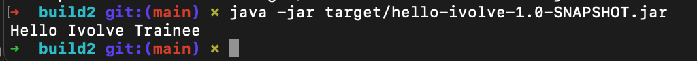

# 🚀 Lab 2: Building and Packaging Java Applications with Maven

## 📌 Overview

This lab demonstrates how to build, test, and run a Java application using **Maven**, and run it locally and using Docker with Java 17.

---

## 🧰 Tools Used

- Java 17
- Maven
- Docker
- Git
- macOS Terminal

---

## 📥 Setup

### Install Maven

```bash
brew install maven


# 📸 Build Result


```
